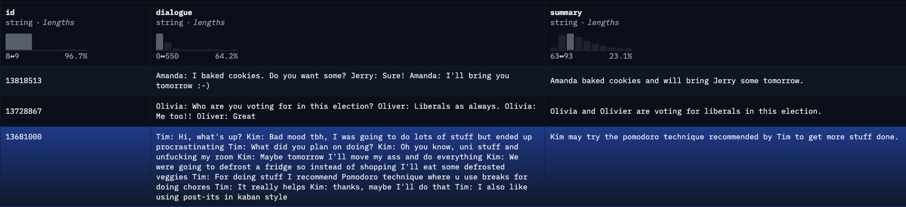

# Supercharge Message Summarization Experience: Parameter-Efficient Fine-Tuning and LLM Assisted Evaluation

## Introduction
In today's business landscape, we are surrounded by a wealth of opportunities to utilize advanced technology powered by AI. Think of large language models(LLMs) as versatile tools in our toolkit: we can *customize* them for a variety of specific downstream tasks, a process known as *fine-tuning*. However, a challenge arises in that each fine-tuned model typically maintains the same parameter size as the original. Therefore, managing multiple fine-tuned models requires careful consideration of factors such as accuracy performance, memory management, inference latency, and disk utilization.

Parameter-Efficient Fine-Tuning (PEFT) methods provide an efficient and streamlined approach for adapting pre-trained LLMs, commonly referred to as *base models*, to a range of specific downstream tasks. These tasks encompass diverse applications, including but not limited to text summarization, question answering, image generation, and text-to-speech synthesis. In contrast to traditional full fine-tuning, which consumes substantial computational resources, PEFT prioritizes the optimization of a significantly smaller parameter subset referred to as "adapters." These adapters work in tandem with the base model, achieving competitive performance while imposing lower computational and storage demands.

I've shared a [Colab notebook](https://github.com/bearbearyu1223/llm-fine-tuning-playground/blob/main/finetune_falcon_7b_conversation_summarization.ipynb) demonstrating a resource-efficient PEFT process using [QLoRA](https://arxiv.org/abs/2305.14314) and [HuggingFace PEFT libraries](https://github.com/huggingface/peft) to fine tune [Falcon-7B-sharded model](https://huggingface.co/vilsonrodrigues/falcon-7b-sharded) on [SamSum dataset](https://huggingface.co/datasets/samsum) for summarizing "message-like" conversations. It achieves reasonable summarization performance after training for only 5 epochs on an A100 compute instance with a single GPU. Additionally, I've employed `GPT-3.5-turbo` to assess generated summaries, showcasing a potentially automated evaluation method by formalizing evaluation guidelines into a prompt template. This approach stands in contrast to traditional metrics like ROUGE or BERTScore, which rely on reference summaries.

Furthermore, I will also share some insights and lessons I've gained throughout this process, with a particular focus on considerations when leveraging LLMs to develop product experiences related to summarization.

I hope you'll discover this article both informative and intriguing, igniting your creativity as you explore the development of your unique product experiences and strategies through the use of fine-tuned foundation models. 

Enjoy the read, and let your innovation flourish!

## Fine-Tuning with Model Quantization and LoRA
Base models such as Claude, T5, Falcon, and Llama2 excel at predicting tokens in sequences, but they *struggle with generating responses that align with instructions*. Fine-tuning techniques, such as **Supervised Fine-Tuning (SFT)** and **Reinforcement Learning from Human Feedback (RLHF)**, can be employed to bridge these gaps. In this sample project, we'll explore the application of SFT to Falcon-7B, a 7-billion-parameter causal decoder model trained by TII on 1,500-billion tokens from RefinedWeb with curated corpora, for conversation summarization tasks.

### Install and Import the Required Libraries 
You can create a virtual environment and install all the required libraries needed for this sample project. In Colab, this can be done by running a cell containing the following scripts:
```Shell 
!pip install huggingface_hub==0.19.4
!pip install -q -U trl accelerate git+https://github.com/huggingface/peft.git
!pip install transformers==4.36.0
!pip install datasets==2.15.0 Tokenizers==0.15.0
!pip install -q bitsandbytes wandb
!pip install py7zr
```
then, import the installed libraries to be used during runtime via:
```Python
import torch
import numpy as np
from huggingface_hub import notebook_login
from datasets import load_dataset, concatenate_datasets
from transformers import AutoModelForCausalLM, AutoTokenizer,BitsAndBytesConfig, AutoTokenizer, GenerationConfig
from peft import LoraConfig, get_peft_model, PeftConfig, PeftModel, prepare_model_for_kbit_training, TaskType
from transformers import TrainingArguments
from trl import SFTTrainer, DataCollatorForCompletionOnlyLM
```
### Prepare the Dataset for Fine-Tuning 
The [SamSum dataset](https://huggingface.co/datasets/samsum)  can be loaded directly using [Hugging Face Datasets libraries](https://huggingface.co/docs/datasets/index) via
```Python
dataset_name = "samsum"
dataset = load_dataset(dataset_name)

train_dataset = dataset['train']
eval_dataset = dataset['validation']
test_dataset = dataset['test']
dataset
```
The dataset contains 14,732 samples for training, 818 samples for validation, and 818 samples for testing. See a sample below. 


### Set up the Configuration for the Fine-Tuning Experiment 
To further reduce the VRAM usage during training, we will fine-tune [a resharded version of Falcon-7B](https://huggingface.co/vilsonrodrigues/falcon-7b-sharded) in 4-bit precision via [QLoRA](https://arxiv.org/abs/2305.14314). 

The code snippet below shows how to load the base model and preprare the base model for the QLoRA experiement in 4-bit precison. 
```Python
model_name = "vilsonrodrigues/falcon-7b-sharded"

bnb_config = BitsAndBytesConfig(
    load_in_4bit=True,
    bnb_4bit_quant_type="nf4",
    bnb_4bit_use_double_quant=True,
    bnb_4bit_compute_dtype=torch.float16,
)

model = AutoModelForCausalLM.from_pretrained(
    model_name,
    quantization_config=bnb_config,
    device_map="auto",
    trust_remote_code=True,
)
model.config.use_cache = False
model.config.pretraining_tp = 1
```
Based on the QLoRA paper, we will taget all linear transformer block layers as target modules for fine-tuning (also see the discussions on reddit [here](https://www.reddit.com/r/LocalLLaMA/comments/15sgg4m/what_modules_should_i_target_when_training_using/?rdt=53925)). The scripts below can be leveraged to find all the taget modules: 

```Python
def find_target_modules(model):
    # Initialize a Set to Store Unique Layers
    unique_layers = set()

    # Iterate Over All Named Modules in the Model
    for name, module in model.named_modules():
        # Check if the Module Type Contains 'Linear4bit'
        if "Linear4bit" in str(type(module)):
            # Extract the Type of the Layer
            layer_type = name.split('.')[-1]

            # Add the Layer Type to the Set of Unique Layers
            unique_layers.add(layer_type)

    # Return the Set of Unique Layers Converted to a List
    return list(unique_layers)
target_modules = find_target_modules(model)
print(target_modules)
```
And in this case, the target modules for fine-tuning will be 
`['dense_4h_to_h', 'dense_h_to_4h', 'query_key_value', 'dense']`. 

After we load the base model, prepare the base model for QLoRA, the configuration used for the fine-tuning experiment can be set via:
```Python
model = prepare_model_for_kbit_training(model)

lora_alpha = 32 
lora_dropout = 0.1 
lora_rank = 16

peft_config = LoraConfig(
    lora_alpha=lora_alpha,
    lora_dropout=lora_dropout,
    r=lora_rank,
    bias="none",
    task_type="CAUSAL_LM",
    target_modules=[
        "query_key_value",
        "dense",
        "dense_h_to_4h",
        "dense_4h_to_h",
    ]
)

peft_model = get_peft_model(model, peft_config)
peft_model.print_trainable_parameters()
```
This configuration will yield `32,636,928 trainable params`, which is only `0.4693018352956629% of the trainable params` compared to the `6,954,357,632 params` of the base model.
### Model Inference of the Fined-Tuned Model 

## Evaluation of Summarization Quality 

When evaluating the quality of summarization generated from the fine-tuned LLM, it is crucial to develop clear and consistent annotation guidelines to provide instructions to the human annotators. Below is a list of metrics that we will consider:

### Metric 1: Relevance
**Capturing the Essence:** The LLM will assist annotators in evaluating the relevance of a summary. Annotators will evaluate the relevance of a summary on a scale of 1 to 5, considering whether the summary effectively extracts important content from the source conversation, avoiding redundancies and excess information. With clear criteria and steps, annotators can confidently assign scores that reflect the summary's ability to convey essential details.

### Metric 2: Coherence
**Creating Clarity:** The LLM will assist annotators in evaluating the coherence of a summary. Annotators will rate summaries from 1 to 5, focusing on the summary's organization and logical flow. Clear guidelines enable annotators to determine how well the summary presents information in a structured and coherent manner.

### Metric 3: Consistency
**Factually Sound:** The LLM will assist annotators in evaluating the consistency of a summary. Annotators will assess summaries for factual alignment with the source conversation, rating them from 1 to 5. SummarizeMaster ensures that annotators identify and penalize summaries containing factual inaccuracies or hallucinated facts, enhancing the reliability of the evaluation process.

### Metric 4: Fluency
**Language Excellence:** The LLM will assist annotators in evaluating the fluency of a summary. Fluency is a critical aspect of summary evaluation. Annotators will assess summaries for grammar, spelling, punctuation, word choice, and sentence structure, assigning scores from 1 to 5.

These instructions are provided as a prompt template to ensure consistent and data-driven evaluation of both human-generated and fine-tuned LLM summaries, aiming to enhance consistency, standardization, and efficiency in an otherwise labor-intensive manual evaluation process.


## Lessons Learned 
Fine-tuning capitalizes on pretraining knowledge but may falter when faced with data that the base model has never encountered in the training dataset. However, it can yield impressive results if that is not the case. 